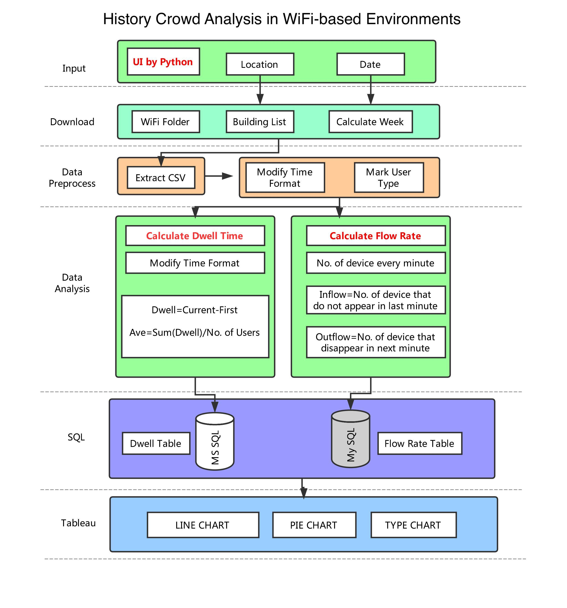

## Master Project: Estimating Crowd Levels in WiFi-based Environments

This is my master project in NUS.



You can see the detail in this [PDF](https://github.com/fainyang/EE_Project/blob/master/mse%20sys/System%20Architecture%20Design.pdf).

My supervisor is [Prof Lawrence Wong](https://www.ece.nus.edu.sg/stfpage/elewwcl/).


Author: [FEI YANG](https://nus-csm.symplicity.com/profiles/feiyang) Master student of NUS ECE.

Email: yangfei@u.nus.edu


## File Structure
```
|- LICENSE  
|- README.md     
|- docs  
|   |-- feiyang.twb  
|   |-- System Architecture Design.pdf
|   |-- quickstart.md  
|- main.py  
|   |-- __init__.py  
|   |-- mysqlwrite.py
|   |-- -- difftime.py
|   |-- copy.py  
|   |-- uniform.py  
|   |-- main_rate.py
|   |-- --time_mac  
|   |-- -- -- generate_time
|- requirements.txt
```